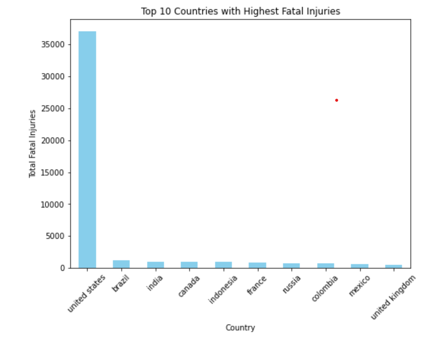
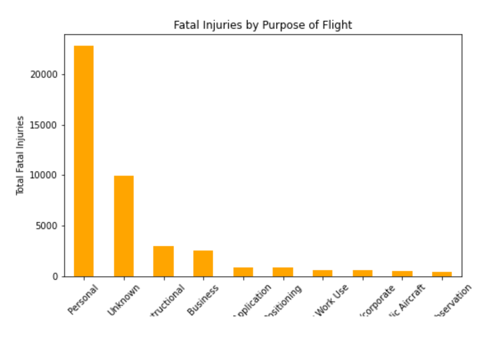
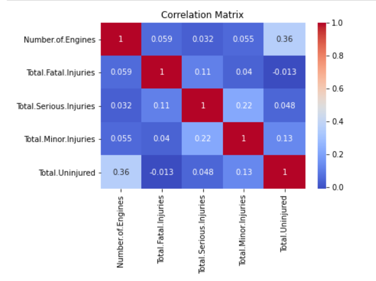
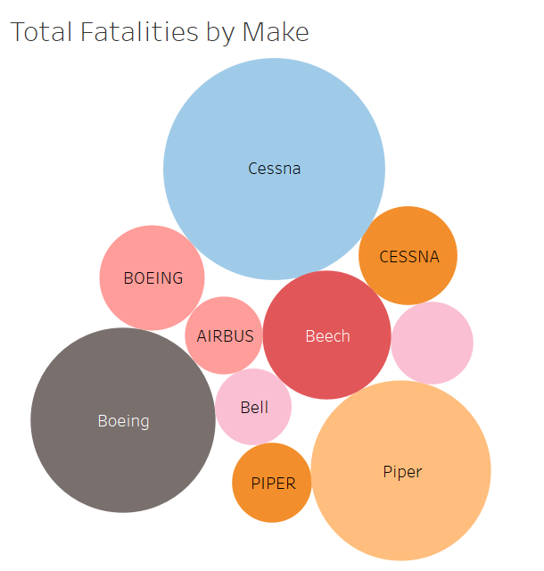

# Aviation Risk Analysis Project

## Overview

This analysis aims to help the company expand into the aviation industry by the accident that have occurred over the years.The aim of the analysis is to help the company determine which aircraft will present the lowest risk for the company. The data used for this analysis comes from the [National Database Accident Database](https://www.kaggle.com/datasets/khsamaha/aviation-accident-database-synopses) and it coverers all civil aviation accidents and selected incidents from 1962 to 2023.
the objective is to clean, analyze, and visualize the data to produce actionable business recomendation that can guide the purchase decision for aircraft.

## Business Understanding

The company is interested in diversifying into the aviation sector but lacks insight into the risks involved in operating different aircraft. The primary stakeholder for this project is the head of the company's new aviation division. The key business questions to address are:
- Which aircraft models have the lowest risk of accidents or incidents?
- Are there specific aircraft characteristics (e.g., year, size) that correlate with a lower accident rate?
- What recommendations can be made to minimize operational risks in this new venture?

## Data Understanding and Analysis

### Data Source
The dataset used in this project comes from the National Transportation Safety Board (NTSB) and contains data on aviation accidents and incidents involving civil aviation from 1962 to 2023. The dataset includes fields such as:
- Accident Date
- Aircraft Model
- Severity of Accident (fatal, non-fatal)
- Aircraft Size (small, large)
- Location
- Additional metadata such as weather conditions, flight phases, etc.

# Aviation Accident Data Analysis

## Data Cleaning

Data cleaning is a critical step before conducting any analysis or creating visualizations. It ensures that the dataset is consistent, accurate, and free from unwanted noise. Below are the specific steps we took in cleaning the dataset.

### Steps Taken for Data Cleaning:

1. **Handling Missing Values**:
   - Some columns had a large number of missing values (e.g., `Latitude`, `Longitude`, `Airport.Code`, `Airport.Name`, `Air.carrier`).
   - We chose to drop columns with excessive missing values that were not directly related to the analysis or would not provide meaningful insights.
   - For numerical columns, such as `Number.of.Engines` and `Total.Fatal.Injuries`, we used the median to fill missing values where appropriate, as these columns contain skewed data.

2. **Dropping Irrelevant Columns**:
   - The following columns were dropped: `Accident.Number`, `Schedule`, `FAR.Description`, `Airport.Code`, `Airport.Name`, `Air.carrier`.
   - These columns were either identifiers, contained too many missing values, or did not add value to our analysis.

3. **Handling Duplicates**:
   - We checked for duplicate records and removed any to ensure data integrity.

4. **Outlier Detection**:
   - We identified and handled outliers in critical columns like `Total.Fatal.Injuries` to avoid skewed analysis.

---

## Exploratory Data Analysis (EDA)

EDA allows us to explore and understand the data more deeply, providing initial insights into the trends and relationships within the dataset.

### Key EDA Steps:

1. **Basic Statistics**:
   - We reviewed the dataset's descriptive statistics, including measures such as the mean, median, and standard deviation.
   - This provided a general overview of the dataset, helping us identify trends, such as the distribution of injuries and the number of engines involved.

2. **Correlation Analysis**:
   - We computed a correlation matrix to understand the relationships between numerical columns like `Total.Fatal.Injuries`, `Number.of.Engines`, and others.
   - For instance, we found a positive correlation between `Number.of.Engines` and `Total.Fatal.Injuries`, indicating that accidents involving more engines tended to have higher fatalities.

3. **Groupby Analysis**:
   - Grouped data by key columns such as `Country` and `Make` to identify trends in fatalities and accidents.
   - Example: Grouped `Country` by `Total.Fatal.Injuries` to understand which countries had the highest number of fatalities.

4. **Unique Values Exploration**:
   - We used `.unique()` and `.map()` to explore unique values and remap categories in the dataset for better clarity.

---

## Data Visualization

Visualizations help in communicating the findings from the data in an easily interpretable way. We used various visualizations to support our conclusions and highlight key insights.

### Key Visualizations:

1. **Correlation Heatmap**:
   - We plotted a heatmap to visualize the correlations between the numerical variables in the dataset.
   - This helped identify which factors were most associated with fatal accidents.

2. **Pie Chart: Impact of Weather on Fatalities**:
   - A pie chart was created to visualize the proportion of fatalities based on weather conditions (`IMC`, `VMC`, and `UNK`).
   - This chart highlights how weather conditions can impact accident outcomes.
   

## 1. Total Fatal Injuries by Country

## 2. Fatalities by Purpose of Aircraft

## 3. Correlation Heatmap

## 4. Fatalities by Make

# Findings

## 1. Geographic Distribution of Fatalities
- The analysis revealed that the **United States** had the highest number of total fatalities, significantly more than other countries.
- **Brazil**, **India**, **Canada**, and **Indonesia** also had substantial numbers of fatalities, though much lower than the U.S.
- The high fatalities in these countries may be due to their large aviation industries and high volumes of air traffic.
  
  **Top 5 Countries by Total Fatalities:**
  - United States: 37,092 fatalities
  - Brazil: 1,254 fatalities
  - India: 975 fatalities
  - Canada: 971 fatalities
  - Indonesia: 959 fatalities

### Recommendation:
Companies considering entering the aviation industry in high-risk countries such as the U.S. should factor in regional safety standards and potential risks. Investing in robust safety measures and better aircraft technology could help mitigate the risk of fatalities.

---

## 2. Weather Conditions and Fatalities
- The data shows that accidents occurring under **Visual Meteorological Conditions (VMC)** account for the majority of fatalities (32,427), followed by **Instrument Meteorological Conditions (IMC)** with 12,075 fatalities.
- Weather marked as **Unknown (UNK)** contributed a smaller, yet still significant, portion of the total fatalities.
  
  **Fatalities by Weather Condition:**
  - VMC (Visual Conditions): 32,427 fatalities
  - IMC (Instrument Conditions): 12,075 fatalities
  - Unknown (UNK): 2,471 fatalities

### Recommendation:
If the company operates in regions with challenging weather conditions (e.g., frequent IMC), investing in aircraft equipped with advanced navigation and weather detection systems will be critical to minimizing risks.

---

## 3. Aircraft Make and Engine Configuration
- The analysis of the **Number of Engines** revealed that aircraft with a higher number of engines tend to have more serious accidents with a higher number of fatalities.
- Certain aircraft makes, such as **Kitty Hawk** and **JOBY AERO INC**, had more fatalities compared to others, while several manufacturers had 0 fatalities, indicating either low usage or better safety records.
  
  **Aircraft Make and Engine Fatalities (Top 5):**
  - Kitty Hawk: 8 fatalities
  - JOBY AERO INC: 6 fatalities
  - Piasecki Aircraft Corp: 4 fatalities
  - Lazair: 4 fatalities
  - BAE Systems: 4 fatalities

### Recommendation:
When considering aircraft purchases, the company should evaluate the safety record of the manufacturer and consider aircraft with fewer engines, which could reduce the likelihood of severe accidents.

---

## 4. Purpose of Flight and Fatalities
- Accidents related to **Personal flights** account for the highest number of fatalities (22,800), followed by **Unknown purposes** (9,967), and **Instructional flights** (2,958).
- This highlights that personal flights, likely involving smaller, privately-owned aircraft, carry a higher risk of fatal accidents.

### Recommendation:
For companies entering the aviation industry, focusing on safety procedures for personal flights, such as additional training and safety checks, could help reduce fatalities.

---

## 5. Aircraft Damage
- The data shows that the majority of fatal injuries occurred in accidents where the aircraft was **destroyed** (41,204 fatalities), followed by accidents resulting in **substantial damage** (14,234 fatalities).

### Recommendation:
Aircraft durability and construction quality are key factors in reducing fatalities. The company should consider purchasing aircraft models with a lower likelihood of destruction in case of accidents.

---

## Conclusion
In summary, the analysis highlights several risk factors that the company must consider when entering the aviation industry. Geographic risks, weather conditions, engine configurations, and the purpose of flights all play a significant role in determining the risk of fatalities. By choosing aircraft with strong safety records, advanced technology for challenging weather conditions, and prioritizing regions with lower fatality rates, the company can mitigate potential risks and make more informed purchasing decisions.

   
### Business Recommendations
Based on the analysis, the following three recommendations can be made for minimizing risks when expanding into the aviation sector:
1. **Prioritize newer models with lower accident rates**: Certain aircraft models, especially newer ones, consistently show a lower frequency of accidents. These should be prioritized for purchase.
2. **Smaller aircraft have fewer incidents overall**: Smaller planes seem to have fewer severe accidents compared to larger planes, making them a safer bet for initial investment.
3. **Time of day and weather considerations**: Data indicates a correlation between accidents and certain flight conditions, such as poor weather or night flights. This should be factored into operational planning.

## Conclusion

Through this analysis, we have identified clear patterns that can guide the company's entry into the aviation industry. By selecting aircraft with a history of lower accident rates and optimizing for safer operational conditions, the company can reduce the risk of entering this new market.

---

